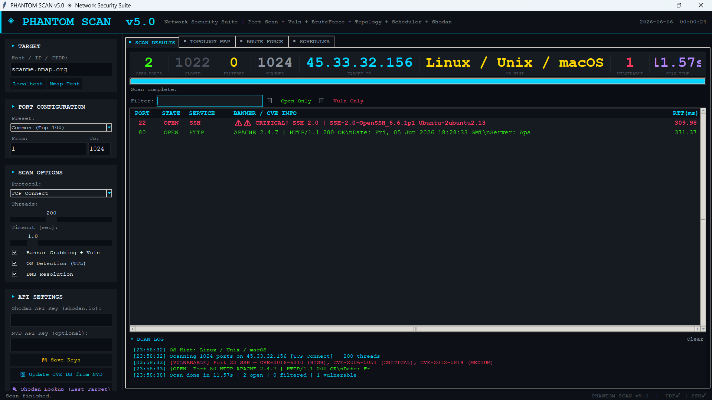
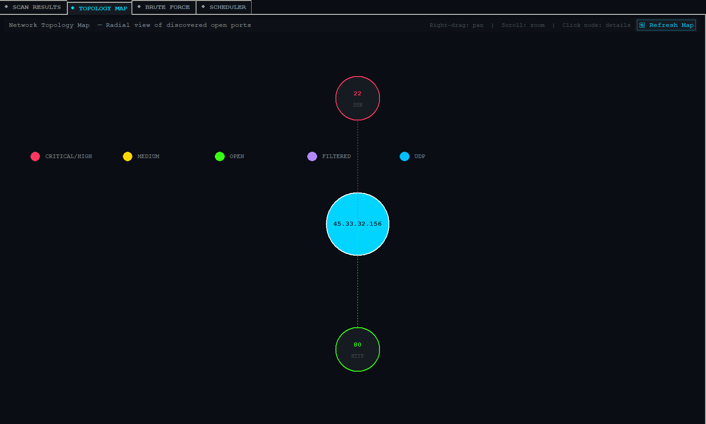
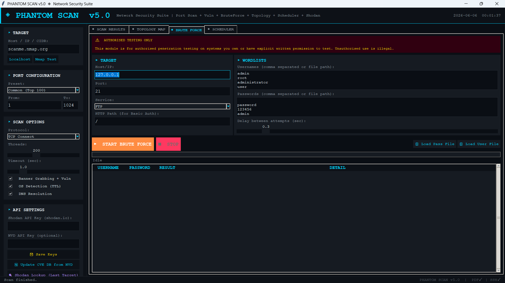
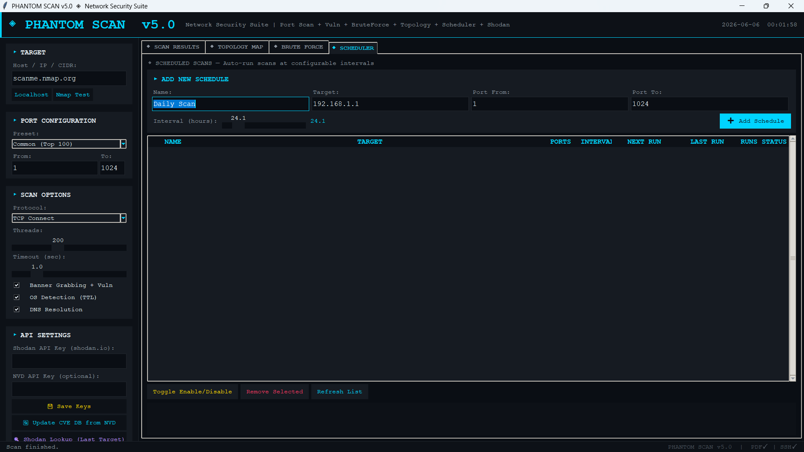

<div align="center">

```
╔══════════════════════════════════════════════════════════════════╗
║        ◈  P H A N T O M   S C A N   v 5 . 0                     ║
║        Advanced Network Security Suite — Python                  ║
╚══════════════════════════════════════════════════════════════════╝
```

[](https://python.org)
[](LICENSE)
[]()
[]()
[]()
[]()

**The most complete open-source network security scanner built in pure Python.**  
Port Scanner · Vulnerability Assessment · SYN Stealth · Brute Force · Topology Map · Shodan · NVD · Docker

[📥 Download](#installation) · [📖 Docs](#usage) · [🐳 Docker](#docker) · [📸 Screenshots](#screenshots)

</div>

---

## 🔍 What is Phantom Scan?

**Phantom Scan v5.0** is a professional-grade, open-source **Network Security Suite** built entirely in Python with zero mandatory external dependencies. It combines a fast multi-threaded port scanner, automatic CVE vulnerability detection, real-time network topology visualization, a service brute-force testing module, scheduled recurring scans, Shodan API intelligence, and NVD CVE auto-updates — all inside a sleek **dark cyberpunk GUI**.

> Built for pentesters, SOC analysts, network admins, and cybersecurity students who want power + usability in one tool.

---

## ✨ Features at a Glance

| Module | What It Does | Requires |
|--------|-------------|---------|
| 🔌 **TCP Connect Scan** | Fast multi-threaded port scanner, up to 500 threads | stdlib only |
| 🕵️ **SYN Stealth Scan** | Raw socket SYN/RST — no TCP handshake, harder to detect | Linux + root |
| 📡 **UDP Scan** | UDP port detection with open/filtered classification | stdlib only |
| 🛡️ **Vulnerability Assessment** | CVE matching from built-in DB + NVD auto-fetch | stdlib only |
| 🗺️ **Network Topology Map** | Interactive radial canvas — zoom, pan, click-for-details | stdlib only |
| 💣 **Brute Force Module** | FTP / SSH / HTTP Basic Auth credential testing | paramiko (SSH) |
| 📅 **Scheduler** | Auto-recurring scans at custom intervals (hourly/daily/weekly) | stdlib only |
| 🌐 **Shodan API** | Live IP intelligence — org, ISP, location, indexed CVEs | Free API key |
| 🔄 **NVD CVE Auto-Update** | Fetch latest CVEs from nvd.nist.gov into live DB | stdlib only |
| 📄 **PDF Report** | Professional dark-themed pentest report | reportlab |
| 📦 **Docker Support** | CLI headless mode + GUI via X11 forwarding | Docker |
| 💻 **CLI Mode** | Scriptable headless scanner for automation pipelines | stdlib only |

---

## 🖥️ Screenshots

> *(Add your screenshots in a `/screenshots` folder)*

| Dark GUI — Scan Results | Topology Map | Brute Force Tab |
|:---:|:---:|:---:|
|  |  |  |

| Vulnerability Detail Popup | Scheduler | PDF Report |
|:---:|:---:|:---:|
|  |  |  |

---

## 🏗️ Architecture

```
┌─────────────────────────────────────────────────────────────────┐
│                    PHANTOM SCAN v5.0                            │
├──────────────┬──────────────────────────────────────────────────┤
│  GUI Layer   │  Tkinter dark theme · 4-tab notebook · live queue│
├──────────────┼──────────────────────────────────────────────────┤
│  Scan Engine │  TCP Connect · SYN Stealth · UDP                 │
│              │  ThreadPoolExecutor · up to 500 threads          │
├──────────────┼──────────────────────────────────────────────────┤
│Banner Grabber│  Protocol probes: FTP/SSH/HTTP/SMTP/Redis/MongoDB│
│              │  Version regex extraction from banners           │
├──────────────┼──────────────────────────────────────────────────┤
│  Vuln Engine │  Built-in CVE DB + NVD API v2.0 live fetch       │
│              │  CVSS scoring · severity · exploit flag          │
├──────────────┼──────────────────────────────────────────────────┤
│  Topology    │  Canvas radial graph · zoom/pan · hover tooltips  │
├──────────────┼──────────────────────────────────────────────────┤
│ Brute Force  │  FTP(ftplib) · SSH(paramiko) · HTTP Basic Auth   │
│              │  Wordlist loader · rate limiting · live results  │
├──────────────┼──────────────────────────────────────────────────┤
│  Scheduler   │  threading.Timer · recurring jobs · auto-report  │
├──────────────┼──────────────────────────────────────────────────┤
│  Integrations│  Shodan API · NVD REST API v2.0                  │
├──────────────┼──────────────────────────────────────────────────┤
│    Export    │  JSON · CSV · TXT · PDF(reportlab) · HTML        │
├──────────────┼──────────────────────────────────────────────────┤
│    Docker    │  Dockerfile · docker-compose · CLI entrypoint    │
└──────────────┴──────────────────────────────────────────────────┘
```

---

## 📦 Installation

### Requirements
- Python **3.8+**
- No `pip install` needed for core features
- Optional packages for extended features (see below)

```bash
# 1. Clone
git clone https://github.com/lavchaudharygc/Panthom-Scan
cd phantom-scan

# 2. (Optional) Install extra features
pip install reportlab   # PDF export
pip install paramiko    # SSH brute-force module
pip install rich        # Coloured CLI output

# 3. Run GUI
python phantom_scan.py        # Windows / macOS / Linux
python3 phantom_scan.py       # Linux explicit

# 4. SYN stealth scan (Linux + root required)
sudo python3 phantom_scan.py
```

---

## 🐳 Docker

```bash
# Build image
docker build -t phantom-scan .

# CLI scan (headless, no display needed)
docker run --rm --network host phantom-scan \
  --target scanme.nmap.org --ports 1-1024 --output /app/reports/result.json

# SYN stealth scan in Docker (needs NET_RAW)
docker run --rm --network host --cap-add NET_RAW phantom-scan \
  --target 192.168.1.1 --ports 1-1024

# Full docker-compose (GUI via X11 on Linux)
xhost +local:docker
docker-compose up phantom-gui
```

---

## 🚀 Usage

### GUI Mode
1. Enter target: hostname, IP, or CIDR (e.g. `192.168.1.0/24`)
2. Choose port preset or enter custom range
3. Select scan type: TCP / UDP / Both / SYN Stealth
4. Enable Banner Grabbing (auto-enables vulnerability detection)
5. Click **◈ START SCAN**
6. Double-click any result row → full CVE breakdown popup
7. Switch to **Topology Map** tab → interactive node graph
8. Export as JSON / CSV / TXT / PDF

### CLI Mode
```bash
# Basic scan
python3 phantom_cli.py --target 192.168.1.1 --ports 1-1024

# Full scan with PDF report
python3 phantom_cli.py --target example.com --ports 1-65535 \
  --threads 300 --timeout 1.5 --output report.pdf

# All options
python3 phantom_cli.py --help
```

### Keyboard Shortcuts (GUI)
| Shortcut | Action |
|----------|--------|
| `Ctrl+S` | Start Scan |
| `Ctrl+X` | Stop Scan |
| `Ctrl+C` | Clear Log |
| `Ctrl+Q` | Quit |
| `F1`     | Help |

---

## 🛡️ Vulnerability Detection

Phantom Scan matches service banners against a built-in CVE database covering:

| Service | CVEs Detected | Max CVSS |
|---------|--------------|----------|
| **FTP** (vsftpd, ProFTPD, Pure-FTPd) | CVE-2011-2523, CVE-2015-3306, CVE-2020-9365 | 10.0 |
| **SSH** (OpenSSH) | CVE-2016-6210, CVE-2006-5051, CVE-2012-0814 | 9.8 |
| **HTTP** (Apache, nginx) | CVE-2021-41773, CVE-2021-42013, CVE-2019-20372 | 9.8 |
| **SMB** (EternalBlue, SambaCry) | CVE-2017-0144, CVE-2017-7494 | 9.8 |
| **RDP** (BlueKeep) | CVE-2019-0708 | 9.8 |
| **MySQL** | CVE-2017-15365 | 7.5 |

**Live NVD Updates:** Click *"🔄 Update CVE DB from NVD"* to fetch new CVEs directly from [nvd.nist.gov](https://nvd.nist.gov) and merge them into the active database.

---

## ⚡ Phantom Scan vs Nmap

| Feature | Phantom Scan v5.0 | Nmap |
|---------|:-:|:-:|
| Graphical User Interface | ✅ Built-in dark GUI | ❌ CLI only (Zenmap separate) |
| Zero mandatory dependencies | ✅ | ❌ Needs install |
| CVE vulnerability matching | ✅ Built-in + NVD live | ⚠️ Via NSE scripts only |
| CVSS score + severity display | ✅ Real-time | ❌ Not shown by default |
| Exploit availability flag | ✅ | ❌ |
| Remediation suggestions | ✅ Per CVE | ❌ |
| Network topology map | ✅ Interactive canvas | ❌ |
| Scheduled / recurring scans | ✅ Built-in scheduler | ❌ |
| Shodan API integration | ✅ | ❌ |
| NVD auto-update | ✅ | ❌ |
| Brute-force module | ✅ FTP/SSH/HTTP | ❌ |
| PDF report generation | ✅ | ❌ |
| Docker container support | ✅ + CLI mode | ❌ |
| Export: JSON + CSV + TXT + PDF | ✅ | ⚠️ XML/grepable only |
| Beginner-friendly | ✅ | ❌ Steep CLI learning |
| SYN stealth scan | ✅ Raw socket | ✅ (root) |
| Full OS fingerprinting | ⚠️ TTL-based hint | ✅ Deep analysis |
| NSE scripting engine | ❌ (planned) | ✅ |
| IPv6 support | ❌ (planned) | ✅ |

> Phantom Scan is not a replacement for Nmap — it's a **complement**: GUI-first, vulnerability-aware, report-ready.

---

## 📁 Project Structure

```
phantom-scan/
├── phantom_scan.py       # Main GUI application (2189 lines)
├── phantom_cli.py        # Headless CLI scanner
├── Dockerfile            # Docker container definition
├── docker-compose.yml    # Multi-service Docker setup
├── requirements.txt      # Optional dependencies
├── phantom_config.json   # Auto-created: API keys storage
├── screenshots/          # Add your screenshots here
│   ├── scan_results.png
│   ├── topology.png
│   ├── brute_force.png
│   └── ...
└── README.md
```

---

## 🗺️ Roadmap

- [ ] SYN stealth scan — Windows support via WinPcap/Npcap
- [ ] IPv6 target support
- [ ] PDF report — graph/chart embeds
- [ ] CVE DB: auto-scheduled nightly NVD sync
- [ ] NSE-style plugin/script engine
- [ ] Service brute-force: RDP + Telnet modules
- [ ] Network sweep: ICMP ping scan before port scan
- [ ] CVSS v3.1 full scoring breakdown
- [ ] Slack/email alert on critical vulnerability found
- [ ] Web interface (Flask) as alternative to Tkinter GUI

---

## ⚠️ Legal & Ethical Use

> **This tool is for authorised security testing only.**
>
> Unauthorised port scanning, vulnerability assessment, or brute-force testing of systems you do not own or have **explicit written permission** to test is **illegal** in India (IT Act 2000, Section 43/66) and most other countries worldwide.
>
> **Safe targets for learning:**
> - `scanme.nmap.org` — Official Nmap test server (legally scannable)
> - `127.0.0.1` — Your own localhost
> - Your own home/lab network
> - Systems in a controlled lab environment (TryHackMe, HackTheBox)

---

## 🤝 Contributing

Contributions, bug reports, and feature requests are welcome!

```bash
# Fork → Clone → Branch → PR
git checkout -b feature/your-feature-name
git commit -m "feat: add amazing feature"
git push origin feature/your-feature-name
# Open Pull Request on GitHub
```

---

## 📄 License

MIT License — see [LICENSE](LICENSE) for details. Free for personal, educational, and commercial use.

---

<div align="center">

**Made with 🖤 in Python**

⭐ **Star this repo if it helped you!** ⭐

[](https://github.com/lavchaudharygc/Panthom-Scan)

*"Security is not a product, but a process."* — Bruce Schneier

</div>
